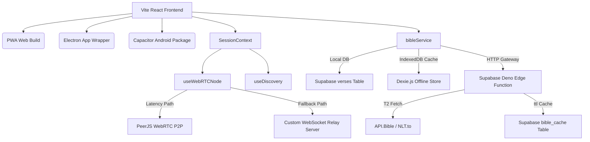

# StreamBible Dual — Deep Technical Audit & Code Architecture

StreamBible Dual is a multi-platform broadcast overlay application designed for church environments. Below is an exhaustive audit of the codebase, detailing how its systems work under the hood, their design rationales, and an analysis of structural bugs and bottlenecks.

---

## 1. Core Architectural Layout

StreamBible is built as a single unified React single-page application (SPA) running React 19, React Router 7, and TypeScript 6, targeting three build modes: Web (PWA), Desktop (Electron), and Mobile (Capacitor/Android).



---

## 2. Real-Time Synchronization Engine

The sync engine handles state updates between the **Controller** (operator dashboard) and the **Overlay / FullScreen** pages (render outputs). It features a **dual-path design** combining direct WebRTC P2P with a WebSocket relay fallback.

### Path A: WebRTC P2P (PeerJS)
- **Host Registration:** The host Controller registers a PeerJS ID of `streambible-room-${roomId}` on the public peer server.
- **Client Connection:** Clients (Overlay/FullScreen) parse the room code from the URL hash and initiate a direct P2P data connection to `streambible-room-${roomId}`.
- **Presence Tracking:**
  - The Host maintains a local `devices` list.
  - Every **5 seconds**, the Host pings connected peers.
  - If a device misses pings for **15 seconds** (evaluated on the heartbeat tick), the Host drops the connection and broadcasts an updated presence array.
- **Latency:** Direct P2P delivers sub-10ms overlay latency under standard LAN conditions.

### Path B: Client-Server WebSocket Relay Fallback
- **Rationale:** Strict corporate firewalls and symmetric NATs regularly block WebRTC peer-to-peer data channels.
- **Implementation:** Both Host and Client establish parallel connections to a custom WebSocket server (`streambible-relay-server`).
- **Bridging:** If WebRTC is blocked, messages (`PUSH_VERSE`, `CLEAR_SCREEN`) are transmitted over the WebSockets connection in a room channel, providing a 100% connection success rate.

---

## 3. LAN Discovery & Presence Architecture

LAN discovery allows controllers on the same physical Wi-Fi network to locate the active host without sharing complex server credentials.

1. **Heartbeat Publish:**
   - The host Controller calls `https://api.ipify.org` on start (and on coming online) to cache its public WAN IP.
   - Every **15 seconds**, if discovery is enabled, `useHeartbeat` submits a POST request to `/api/heartbeat` containing `{ room_id, host_device_id, public_ip, is_discoverable }`.
2. **Relay Server Memory Store:**
   - The relay server maintains active heartbeats in an in-memory `Map`.
   - Heartbeats are evicted if not refreshed within **30 seconds** (cleaned up on read or via a global 60-second cleanup interval).
3. **LAN Lookup:**
   - Client devices on the same Wi-Fi query `/api/discovery?ip=${public_ip}`.
   - Since devices on the same local network egress through the same NAT gateway, they share a public IP. The relay server returns all active sessions matching this IP, enabling seamless auto-discovery.

---

## 4. Tiered Bible Data & Caching System

The application fetches scripture through a complex network of fallback paths designed to guarantee operational stability and speed.

| Translation Tier | Data Source | Storage Location | Performance Profile |
| :--- | :--- | :--- | :--- |
| **Tier 1 (Native Local)** | KJV, Yoruba (BM), ASV, BSB, WEB | Supabase `verses` table | Local/Database fetch (~15ms) |
| **Tier 2 (External API)** | NKJV, NIV, AMP, NLT | API.Bible / NLT.to | Remote HTTP fetch via Edge Function (~400ms) |

### Double-Cache Logic
1. **IndexedDB (Dexie.js):** When `fetchVerse` runs, it queries IndexedDB first using the composite key `sb_${versionId}_${formattedRef}`. If found, it returns in **0ms** (completely offline).
2. **Supabase `bible_cache` Table:** If not in IndexedDB, the query hits the Supabase Edge Function. The Edge Function checks its cloud-based cache table. Hits that have not exceeded a **30-day TTL** are returned immediately to conserve external API rate limits.
3. **HTML Sanitization & Parsing:**
   - The Edge Function strips HTML formatting (`<head>`, `<h2...>`, scripts, footnotes, tags).
   - It replaces bracketed numbers like `[1]` or HTML verse spans with a custom unified marker `{{v:1}}`.
   - The client parses this format using regex to render bold superscript verse numbers on screen.
4. **Offline Pre-Caching:** The Setlist manager loops through user-selected verses and fetches them sequentially, triggering their write to IndexedDB. This ensures that a church can run an entire service with no internet connection.

---

## 5. Multi-Platform Packaging

- **Vite PWA:** Utilizes `vite-plugin-pwa` with `autoUpdate`. Bundles assets like icons and registers a service worker to cache application pages for web browsers.
- **Electron (Desktop):**
  - **Launch Optimization:** Spawns a frameless, transparent splash window (`createSplash`) displaying an animated CSS loading icon. Spawns the main window in the background (`show: false`). Destroys the splash and reveals the main window only on `ready-to-show` to prevent white page flickering.
  - **Native Bridge:** Uses Electron IPC handlers (`dialog:saveFile`) to let the React app write setlists directly to the host PC file system.
- **Capacitor (Mobile):** Integrates native iOS/Android web views, allowing the overlay controller dashboard to compile into a native APK.

---

## 6. Critical Bug Analysis: "Authenticated Hosts Cannot Join Rooms"

There is a severe logical loop in [SessionContext.tsx](file:///c:/Users/danie/OneDrive/Documents/Projects/Streambible-suite/bible-overlay/streambible-dual/src/context/SessionContext.tsx#L78-L115) that prevents authenticated users from joining guest sessions:

```typescript
useEffect(() => {
  const fetchAuthAndProfile = async () => {
    const { data: { user } } = await supabase.auth.getUser();
    setUser(user);
    
    if (user) {
      const { data } = await supabase
        .from('profiles')
        .select('claimed_room_id, has_onboarded')
        .eq('id', user.id)
        .single();
        
      if (data) {
        setHasOnboarded(!!data.has_onboarded);
        if (data.claimed_room_id) {
          setClaimedRoomId(data.claimed_room_id);
          setRoomId(data.claimed_room_id); // <-- FORCED RESET
          localStorage.setItem(`streambible-host-${data.claimed_room_id}`, 'true');
          localStorage.setItem(LS_ROOM_KEY, data.claimed_room_id);
        }
      }
    }
  };
  
  fetchAuthAndProfile();
  // ...
}, [roomId]); // <-- TRIGGERED ON ANY ROOM CHANGE
```

### Impact & Mechanism
1. An authenticated host (who has a `claimed_room_id` in Supabase) joins a new room (e.g., clicking a link or discovery card).
2. The `roomId` state updates, triggering the `useEffect` because `roomId` is in the dependency array.
3. The hook queries Supabase Auth, retrieves the user profile, finds the `claimed_room_id`, and calls `setRoomId(data.claimed_room_id)`.
4. The user is instantly kicked out of the guest room and forced back to their personal host room.

*Fix Strategy:* The profile fetching logic should run **only once on initial load (auth state change)** rather than on every `roomId` change.
